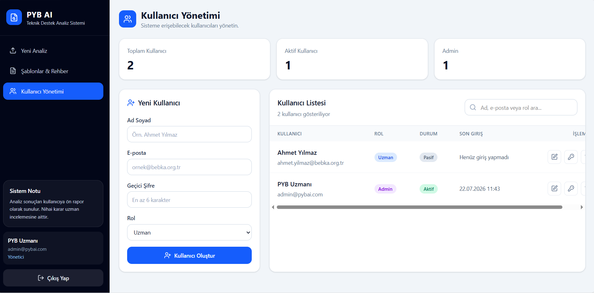
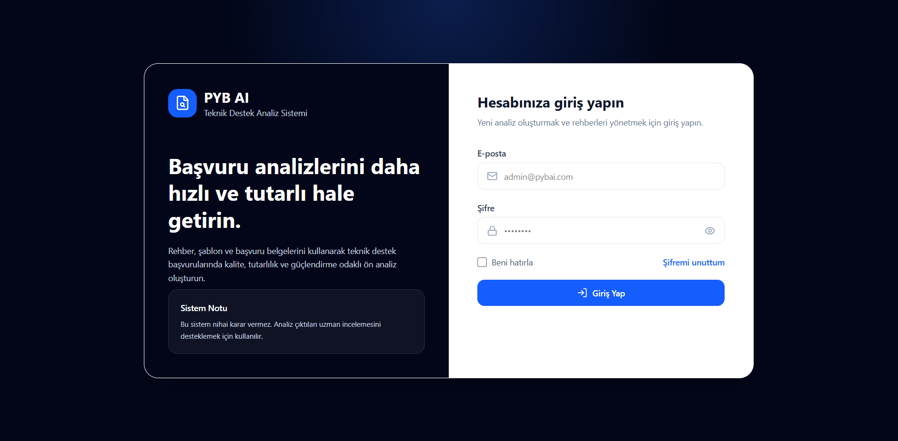
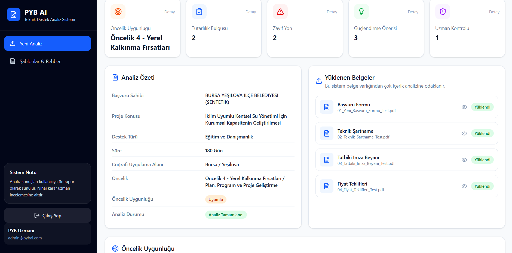
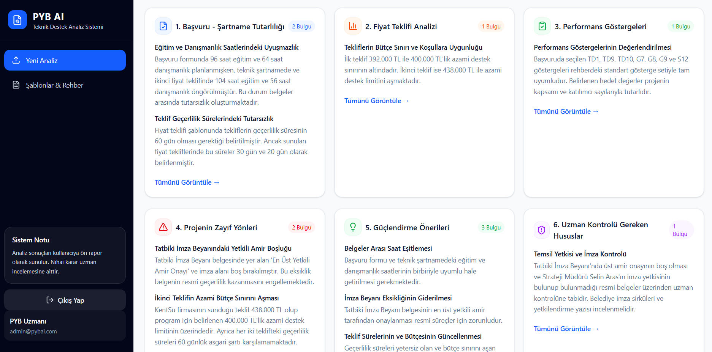
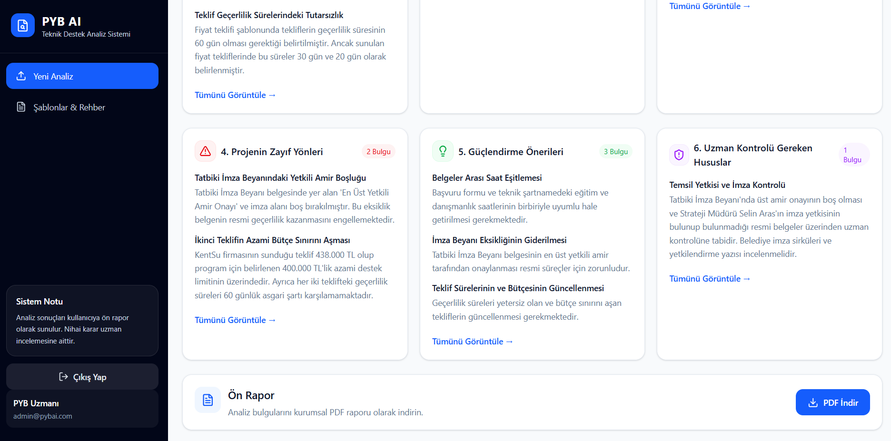
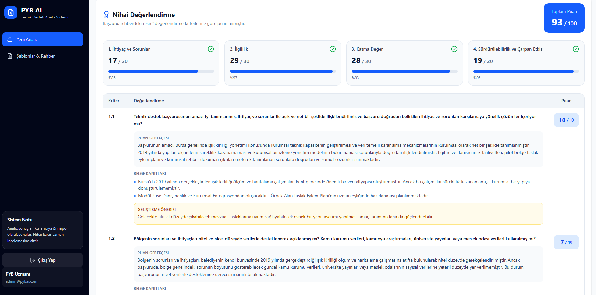
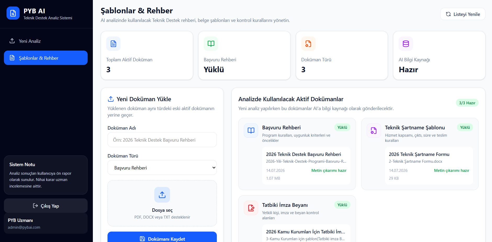

# PYB AI Analysis

> AI-powered preliminary evaluation and committee report generation system for Technical Support Program applications.



---

## Overview

PYB AI Analysis is a full-stack web application developed to support the preliminary evaluation process of Technical Support Program applications.

The system analyzes uploaded application documents using Google's Gemini AI, detects inconsistencies, identifies strengths and weaknesses, generates structured preliminary analysis reports, and assists evaluation committees by automatically preparing official committee report drafts based on manually entered evaluation scores.

---

## Features

### AI Preliminary Analysis

- AI-powered application analysis
- Priority alignment analysis
- Consistency checks
- Need analysis
- Sustainability analysis
- Target group analysis
- Performance indicator analysis
- Weak point detection
- Recommendation generation
- Expert review detection
- Preliminary report generation

### Committee Report Generation

- Manual evaluation score entry
- Automatic total score calculation
- AI-generated committee comments
- Category-based evaluation
- Word (.docx) committee report export

### Document Management

- Upload reference guides
- Upload committee report examples
- Upload technical specifications
- Upload signature declaration templates
- Activate / deactivate templates
- Automatic document text extraction

---

## Tech Stack

### Frontend

- React
- Vite
- Tailwind CSS
- Axios
- React Router

### Backend

- Node.js
- Express.js
- MongoDB
- Mongoose
- Multer
- PDFKit
- Docx

### AI

- Google Gemini API
- Gemini 3.1 Flash Lite
- Gemini 3.5 Flash Lite (Fallback)

---

## Project Structure

```text
pyb-ai-analysis
│
├── client
│   ├── src
│   ├── public
│   └── ...
│
├── server
│   ├── controllers
│   ├── middleware
│   ├── models
│   ├── routes
│   ├── services
│   └── ...
│
├── screenshots
│
└── README.md
```

---

## Screenshots

### Login



---

### AI Analysis







---

### Committee Report



---

### Admin Dashboard


---

### Templates



---

## Installation

Clone the repository

```bash
git clone https://github.com/serkanoztas/pyb-ai-analysis.git
```

Install dependencies

### Frontend

```bash
cd client
npm install
npm run dev
```

### Backend

```bash
cd server
npm install
npm run dev
```

---

## Environment Variables

Create a `.env` file inside the `server` directory.

```env
PORT=

MONGODB_URI=

JWT_SECRET=

GEMINI_API_KEY=

GEMINI_MODEL=gemini-3.1-flash-lite

GEMINI_FALLBACK_MODEL=gemini-3.5-flash-lite
```

---

## AI Workflow

1. Upload application documents
2. Extract document text
3. Load active reference documents
4. Build AI prompt
5. Analyze application using Gemini AI
6. Generate preliminary analysis report
7. Committee members enter evaluation scores
8. Generate committee report comments
9. Export Word committee report

---

## Generated Reports

- Preliminary Analysis Report (PDF)
- Committee Evaluation Report (Word)

---

## Future Improvements

- OCR support
- Role-based authorization
- Dashboard analytics
- Multi-user support
- KAYS integration
- Application history
- Audit logs

---

## License

This project was developed for educational and internship purposes.
